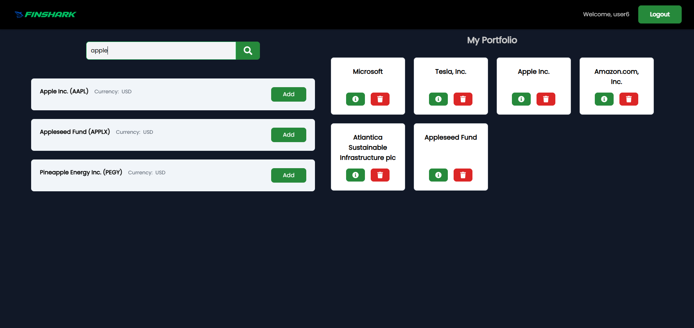

# Stock Portfolio Management System

## Version  
1.0.0  

### Back-end - [GitHub Repository](https://github.com/Pravinda-Bandara/Stock-Portfolio-Management-backend)  

## Introduction  

Welcome to our Stock Portfolio Management System! This platform allows users to log in and manage their stock investments interactively. Users can add stocks to their portfolio, view detailed stock information, and post comments to discuss investments. The platform leverages the **Financial Modeling Prep API** for real-time stock data, providing an engaging and informative experience for users.  
Our frontend powered by **React**,**TaiwindCSS**,**Typescript** and  backend, powered by **.NET with Entity Framework (EF)** and **MS SQL**, efficiently handles HTTP requests, user authentication using JWT (JSON Web Tokens), and database interactions.

## Features  

### User Features  
- **User Authentication:** Users can securely register and log in.  
- **Portfolio Management:** Add, update, and delete stocks in your portfolio.  
- **Detailed Stock Information:** View real-time stock details using the Financial Modeling Prep API.  
- **Commenting System:** Post and view comments on specific stocks.  

## Preview  

  
  

  
  

  
  

## Frontend Technologies Used  

- **Framework:** React.js  
- **Styling:** Tailwind CSS  
- **State Management:** Context API  
- **HTTP Client:** Axios  
- **Routing:** React Router  
- **Notifications:** React Toastify  

## Backend Technologies Used  

- **Framework:** .NET Core with Entity Framework (EF)  
- **Database:** MS SQL  
- **Authentication:** JSON Web Tokens (JWT)  
- **API Integration:** Financial Modeling Prep API  

## Usage Disclaimer  

This project and its associated images are used for educational and learning purposes only. The application and any included images are not intended for commercial use.  

## License  

Copyright &copy; 2024 Pravinda Bandara. All Rights Reserved.  
This project is licensed under the [MIT License](LICENSE.txt).  
